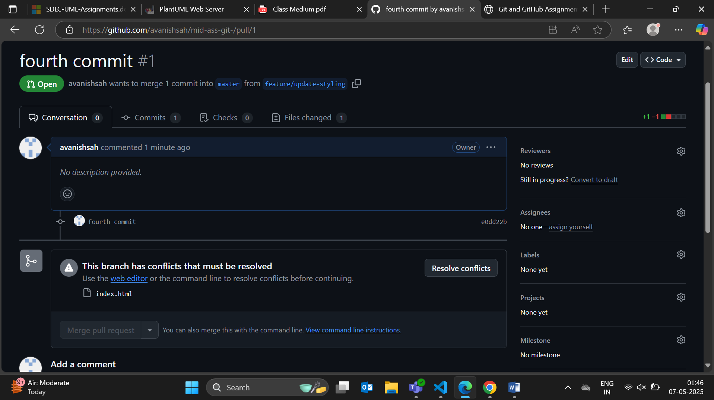

# Git Branch Merge Assignment

## Overview
This project demonstrates branching strategies and resolving merge conflicts using GitHub Flow. A simple web page was edited through two feature branches: one added new content, and the other updated styling.

## Branches
- `feature/add-content`
- `feature/update-styling`

## Conflict Summary
A merge conflict occurred when merging both feature branches that edited the same `index.html` file.

## Conflict Resolution
Screenshots:
- **Merge Conflict**: 
- **Resolution**: 

The conflict was resolved by combining content from both branches and removing conflict markers.

## GitHub Repo
[Your GitHub Link Here](https://github.com/avanishsah/mid-ass-git-)
